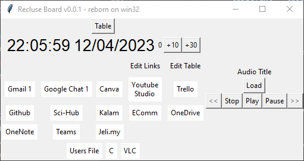
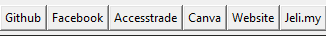
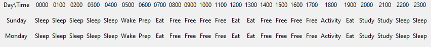

# Recluse Board
[](https://sourceforge.net/projects/recluseboard/files/latest/download) 

   

### Interface



## Installation

```console
# clone the repo
$ git clone https://github.com/darwishzain/recluse-board.git

# change the working directory to recluse-board
$ cd recluse-board

# install the requirements
$ python3 -m pip install -r requirements.txt
```

## Run Recluse Board
```
# Run Recluse Board from Command Line
$ cd src
$ python -u main.py
```

## Development
### Debian
#### Install python virtual environment
```
sudo apt-get install python3-venv
```
#### Activate virtual environment
```
source myenv/bin/activate  # On Linux/macOS
myenv\Scripts\activate  # On Windows
```

## Syntax

#### link.csv
```
name,link
name,link
```
Example
```
Github,https://github.com
Facebook,https://facebook.com
```
Result


#### week.csv

```
activity,activity,activity,activity,activity
```
Example
```
Sleep,Study,Exercise,Reading,Cooking
```

### Default CSV
#### link.csv
```
Example Google, https://google.com
Example Youtube,https://studio.youtube.com/
Example Github,https://github.com
Example Sci-Hub,https://sci-hub.se/
Example OneDrive,https://onedrive.live.com/
"Jeli.my",https://jeli.com.my/index.php?home
```
#### shortcut.csv
```
Users File,C:\Users
C,C:\
CSV,./csv
VLC,C:\Program Files (x86)\VideoLAN\VLC\vlc.exe
```
Result


#### Stargazer
[](https://github.com/darwishzain/recluse-board/stargazers)
