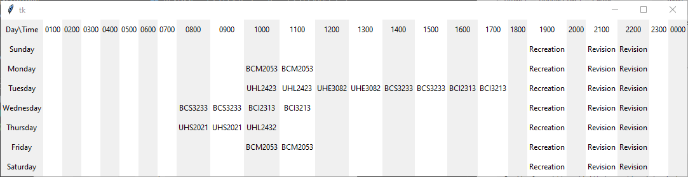

# Recluse Board
[](https://sourceforge.net/projects/recluseboard/files/latest/download) 

   

### Interface




## Installation

```console
# clone the repo
$ git clone https://github.com/darwishzain/recluse-board.git

# change the working directory to sherlock
$ cd recluse-board

# install the requirements
$ python3 -m pip install -r requirements.txt
```

## Run Recluse Board
```
# Run Recluse Board from Command Line
$ cd src
$ python -u main.py
```
## Syntax

#### link.csv
```
name,link
name,link
```
Example
```
Github,https://github.com
Facebook,https://facebook.com
```
Result


#### week.csv

```
activity,activity,activity,activity,activity
```
Example
```
Sleep,Study,Exercise,Reading,Cooking
```
Result


#### Stargazer
[](https://github.com/darwishzain/recluse-board/stargazers)
